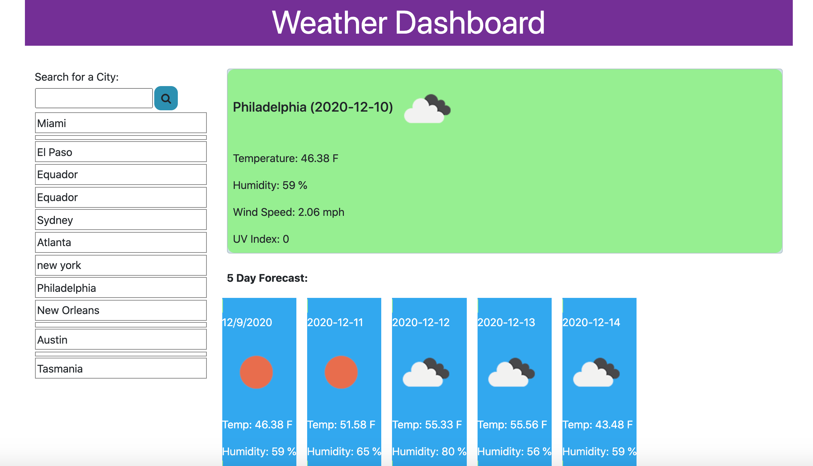
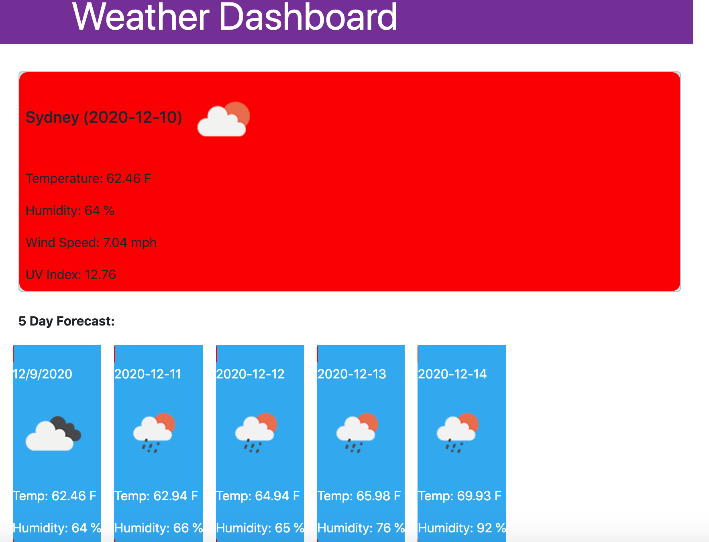

Meredith Jones- Weather App

I created this weather app to function as an easy reference for travelers who would like to see what the weather is/will be for the next 5 days in cities that they are considering visiting. In addition, cities that have been searched are stored in local storage on the site and displayed beneath the search bar for easy reference. If the user clicks on the city where it has been stored, the weather information will once again appear. 

If the UV Index in city where the weather is being referenced is not at a level for concern, the background for the main weather display will be a light green, as shown below in the forcast for Philadelphia.

For an eye catching reference, conditions with a UVI index which is harmfully high will change the background color of the main weather display to alert the user that conditions are potentially hazardous. In the example below, I searched for a city in Australia so that the color function for a high UVI would display: 

In order to create this app, I utilized the OpenWeather API to reference all of the weather data as well as to populate the appropriate icons to accompany the rest of the data. I used Font Awesome for the search icon on the bar, and bootstrap for styling. 

This work definitely helped to reinforce my learning process with using local storage, and I found it more intuitive to program than during the last project where I used it. I felt the most comfortable in the aspects of the project where I was writing the html and css portions. I am still quite new using jquery and AJAX, so although I did use them, I do find it to be a challenge and I know that there were places in the project where I could have used them further to make the app function more dynamically and the code more concise. 

For the stage that I currently am in my learning, I feel good that I was able to accomplish utilizing local storage successfully in a way that I have not in the past, as well as working with an API for the first time. I think that gaining a comfort level with these tools will help me to create rich pages in the future. 

